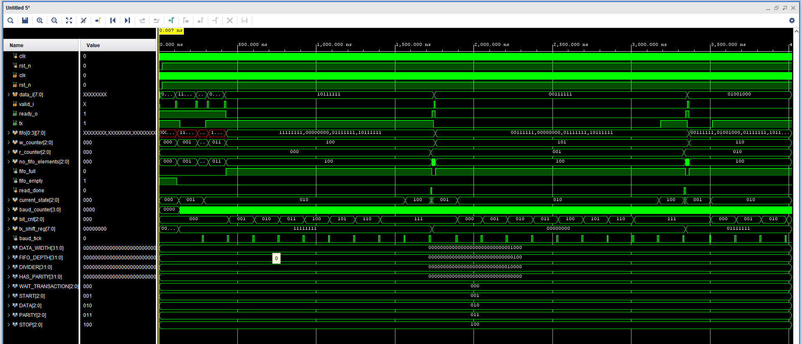

# UART Transmitter – SystemVerilog Verification Environment

## Overview

A complete **SystemVerilog class-based verification environment** for a parameterizable UART Transmitter (`uart_tx`) with integrated FIFO buffer. The testbench follows a layered architecture inspired by UVM methodology, featuring constrained-random stimulus generation, self-checking scoreboard, functional coverage, and protocol assertions.

## Design Under Test (DUT)

The `uart_tx` module implements a serial UART transmitter with the following features:

- **Parameterizable** data width, FIFO depth, baud divider, and optional parity
- **FIFO buffer** (default depth = 4) for queuing data before transmission
- **Valid/Ready handshake** on the input interface
- **FSM-based TX engine** with states: WAIT → START → DATA → (PARITY) → STOP

Default parameters:

| Parameter    | Default | Description                          |
|-------------|---------|--------------------------------------|
| DATA_WIDTH  | 8       | Number of data bits per frame        |
| FIFO_DEPTH  | 4       | Internal FIFO depth                  |
| DIVIDER     | 16      | Clock cycles per UART bit period     |
| HAS_PARITY  | 0       | Enable parity bit (0 = off, 1 = on)  |

## Testbench Architecture

```
┌──────────────────────────────────────────────────┐
│                    Testbench                      │
│                                                   │
│  ┌───────────┐    mailbox    ┌──────────┐        │
│  │ Generator ├──────────────►│  Driver  │        │
│  └───────────┘               └────┬─────┘        │
│                                   │ vr_intf       │
│                              ┌────▼─────┐        │
│                              │   DUT    │        │
│                              │ uart_tx  │        │
│                              └──┬───┬───┘        │
│                        vr_intf  │   │ uart_intf   │
│                  ┌──────────────┘   └──────┐     │
│                  ▼                          ▼     │
│         ┌───────────────┐         ┌────────────┐ │
│         │ Monitor (VR)  │         │Monitor(UART)│ │
│         └───────┬───────┘         └──────┬─────┘ │
│                 │        mailbox         │       │
│                 └────────┐  ┌────────────┘       │
│                          ▼  ▼                    │
│                    ┌────────────┐                 │
│                    │ Scoreboard │                 │
│                    └──────┬─────┘                 │
│                           │                      │
│                    ┌──────▼─────┐                 │
│                    │  Coverage  │                 │
│                    └────────────┘                 │
└──────────────────────────────────────────────────┘
```

### Components

| File | Role |
|------|------|
| `testbench.sv` | Top-level module – clock/reset generation, DUT instantiation, interface binding |
| `environment.sv` | Orchestrates all verification components |
| `generator.sv` | Produces constrained-random and directed transactions |
| `driver_valid_ready.sv` | Drives the valid/ready input interface |
| `monitor_valid_ready.sv` | Monitors input-side handshake signals |
| `monitor_uart.sv` | Deserializes and monitors the UART TX output |
| `scoreboard.sv` | Compares input data against UART output for self-checking |
| `coverage.sv` | Functional coverage: data values, delays, UART output bins |
| `transaction_valid_ready.sv` | Input-side transaction class with constraints |
| `transaction_uart.sv` | UART-side transaction class |
| `interface_valid_ready.sv` | Valid/Ready interface with clocking blocks and assertions |
| `interface_uart.sv` | UART interface with clocking blocks and post-reset assertion |
| `design.sv` | RTL – the `uart_tx` module |

### Test Scenarios

| Test File | Description |
|-----------|-------------|
| `default_test.sv` | 5 random transactions |
| `default_big_test.sv` | 1000 random transactions (stress test) |
| `directed_test.sv` | Directed corner-case values: 0, 63, 127, 191, 255 |
| `directed_test_long_delay.sv` | Directed test with specific hex patterns (0xAA, 0x55, 0xFF, 0x00, 0x80) |
| `test_for_output_delay.sv` | Directed test with inter-transaction clock delays |

## How to Run

Select the desired test by editing `testbench.sv` – uncomment the corresponding `include`:

```systemverilog
//`include "directed_test.sv"
//`include "default_test.sv"
//`include "default_big_test.sv"
`include "directed_test_long_delay.sv"
```

### Using Vivado (xsim)

```bash
xvlog --sv design.sv testbench.sv
xelab testbench -s sim_snapshot
xsim sim_snapshot -R
```

## Key Verification Features

- **Constrained-random generation** – data values and inter-transaction delays are randomized with weighted distributions
- **Self-checking scoreboard** – input data is queued and compared bit-by-bit against deserialized UART output
- **Functional coverage** – covergroups track data value ranges, delay distributions, and UART output bins
- **Protocol assertions** – valid/ready handshake rules and post-reset TX idle check
- **Mailbox-based communication** – generator → driver, monitors → scoreboard

## Simulation Results

All tests pass with **0 scoreboard mismatches**. Below is a summary of the results obtained in QuestaSim:

| Test | Transactions | SCB Result | VR Coverage | UART Coverage |
|------|-------------|------------|-------------|---------------|
| `directed_test` | 5 directed + 5 random | All PASS | 83.33% | 61.33% |
| `default_test` | 5 random | All PASS | 65.56% | 61.33% |
| `directed_test_long_delay` | 5 directed | All PASS | 65.56% | 34.67% |

### Waveform

The waveform below shows the `directed_test_long_delay` simulation, illustrating the FIFO fill-up, FSM state transitions (WAIT → START → DATA → STOP), and correct UART serialization of data bytes `0xAA`, `0x55`, `0xFF`, `0x00`, `0x80`:



Simulation logs for each test are available in the [`sim_results/`](sim_results/) folder.

## Project Structure

```
├── design.sv                    # RTL: uart_tx module
├── testbench.sv                 # Top-level testbench
├── environment.sv               # Verification environment
├── generator.sv                 # Transaction generator
├── driver_valid_ready.sv        # Input driver
├── monitor_valid_ready.sv       # Input monitor
├── monitor_uart.sv              # UART output monitor
├── scoreboard.sv                # Self-checking scoreboard
├── coverage.sv                  # Functional coverage
├── transaction_valid_ready.sv   # Input transaction class
├── transaction_uart.sv          # UART transaction class
├── interface_valid_ready.sv     # Valid/Ready interface
├── interface_uart.sv            # UART interface
├── default_test.sv              # Random test (5 transactions)
├── default_big_test.sv          # Random test (1000 transactions)
├── directed_test.sv             # Directed corner-case test
├── directed_test_long_delay.sv  # Directed test with hex patterns
├── test_for_output_delay.sv     # Directed test with delays
└── sim_results/
    ├── log_default_test.txt
    ├── log_directed_test.txt
    ├── log_directed_test_long_delay.txt
    └── waveform_directed_test_long_delay.png
```

